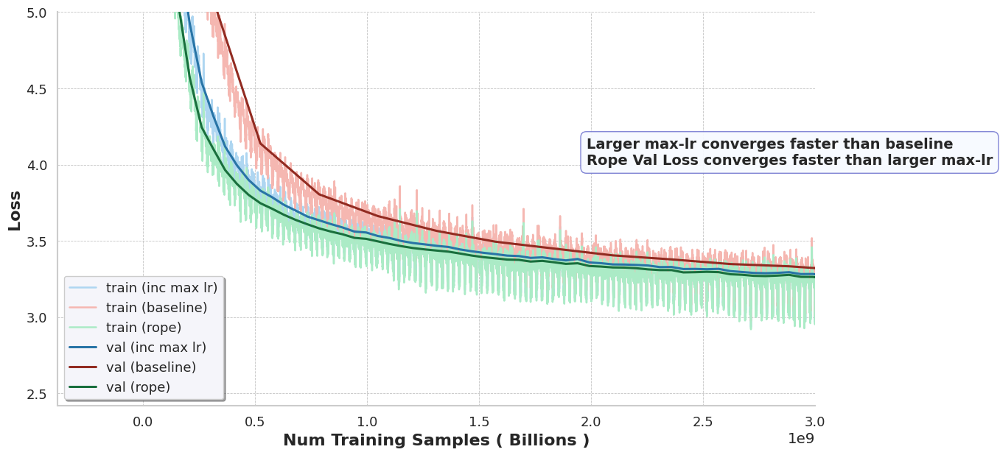
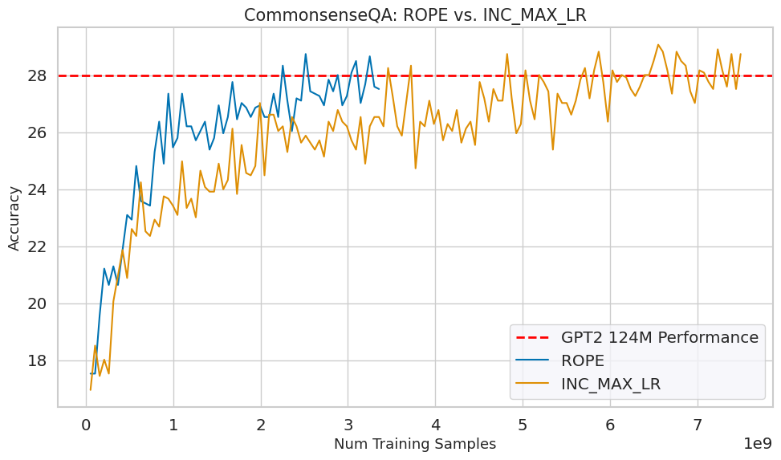

# 🚀 Train GPT2 Performance Model for ~$5

> **Note**: This repo is based on [Andrej Karpathy's nanoGPT](https://github.com/karpathy/nanoGPT), with adaptations to decrease cost to train and improve model performance 

This repo is to build and benchmark models intended to **outperform GPT2** (124M) — all while keeping total training costs **under $10** (estimated GPU rental, late 2025). 💸⚡️

- 🧠 **Cutting-edge Techniques:** Integrating the latest SOTA research to slash training time *and* expenses!
- 🏗️ **Reference Point:** Standard GPT2 (124M params) as baseline, compared with improved models using:
    - 🔥 Smarter learning rate schedules
    - 🍦 SwigLU activations
    - 🔄 Rotary positional embeddings replacing absolute pos. embeddings
- 💰 **Cost Estimate:** The ROPE model reaches GPT2-124M commonsense_qa accuracy after training on 3B samples. 🏋️‍♂️ On a single H100 GPU, this takes approximately 100 minutes (Optimized batch sizing for H100, compiled model). With H100 spot pricing averaging $3/hour (late 2025), the total training cost is just **$5**! 🚀

---

## 📈 Model Performance & Comparison

| 🚦 Progress Over Baseline  |
|:-------------------------:|
|  |
|          |

---

## 🛠️ Training Models Made Easy

| 📚 Model Variant           | ▶️ Command                              |
|:-------------------------- |:----------------------------------------|
| 🟦 GPT2 124M Baseline      | [`make train_baseline`](Makefile#L1)   |
| 🟥 Increased Max LR        | [`make train_increase_max_lr`](Makefile#L21)  |
| 🟩 Rotational Pos Emb      | [`make train_rotational_pos_emb`](Makefile#L40) |

---

## 🗺️ What’s Next?

- [x] ✅ commonsense_qa
- [x] ✅ exp 1 - baseline gpt
- [x] ✅ exp 2 - larger lr gpt2 until meet gpt2 perf
- [x] ✅ exp 3 - ROPE until meet gpt2 perf
- [ ] ✳️ exp 4 - Swiglu
- [x] ✅ gpt2 on commonsense_qa
- [ ] ⏫ scale up the model
- [ ] 📊 v3 model performance on commonsense_qa 
- [ ] 🪶 quantized inference and benchmark
- [ ] 🧑‍💻 vanilla C serve model

---

Let’s make *state-of-the-art* cheap, fun, and open! 🌟